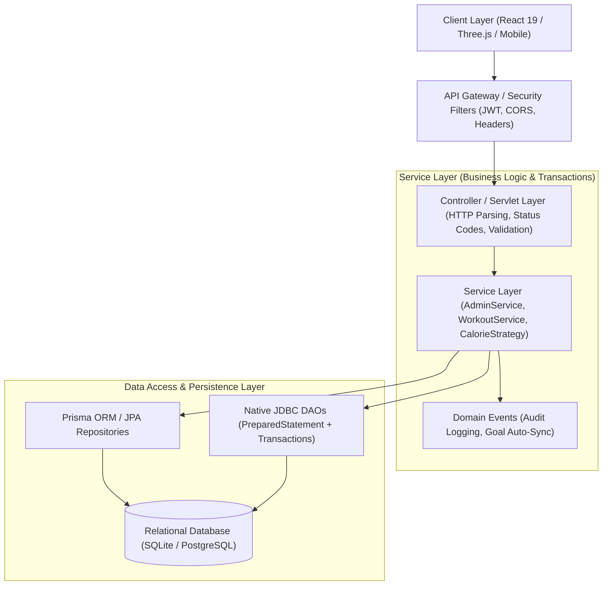
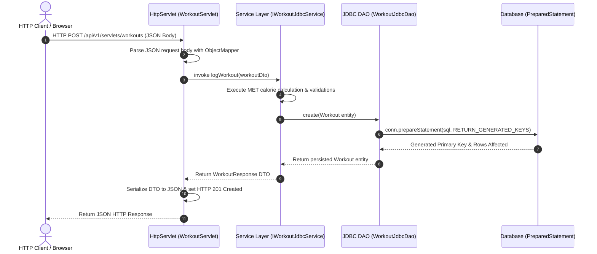

# FitPulse — Enterprise System Architecture Specification

## 1. High-Level Architecture Overview

**FitPulse** is an enterprise-grade full-stack health, biometric telemetry, and athletic training platform engineered with a clean, decoupled 3-tier architecture. It features parallel runtime support for both a high-throughput **Node.js / Express** REST microservice and an enterprise **Java 21 / Spring Boot 3.3.4** subsystem with native **JDBC** and **Jakarta Servlets**.

```
fitpulse/
├── frontend/             # React 19 + Vite 8 + Three.js / R3F + Tailwind CSS v4
├── backend/              # Node.js + Express / TypeScript REST API Engine
│   ├── src/              # Express controllers, services, routes, middleware, schemas
│   └── java-spring/      # Spring Boot 3.3.4 enterprise microservice (Java 21 LTS)
│       └── src/main/java/com/fitpulse/
│           ├── config/       # Security, OpenAPI Swagger, CORS, DataSource
│           ├── controller/   # REST Controllers (Auth, Workout, Goal, Challenge, Content, Admin)
│           ├── dto/          # Data Transfer Objects & Generic ApiResponse<T>
│           ├── exception/    # Hierarchical Domain Exceptions & GlobalExceptionHandler
│           ├── jdbc/         # Native JDBC DAOs (UserJdbcDao, WorkoutJdbcDao, ChallengeJdbcDao)
│           ├── model/        # Encapsulated Domain Entities & Parameterized Enums
│           ├── repository/   # Spring Data JPA repositories with BaseRepository
│           ├── security/     # JWT Token Provider, UserDetailsService, AuthFilter
│           ├── service/      # Decoupled Interfaces & Concrete Implementations
│           │   └── jdbc/     # Native JDBC Service Layer (User, Workout, Challenge)
│           ├── servlet/      # Native Jakarta Servlets (WorkoutServlet, GoalServlet, etc.)
│           └── strategy/     # Polymorphic MET Calorie Calculation Engine
├── database/             # Prisma schema, SQL DDL migrations, seed scripts, SQLite/PostgreSQL
├── docs/                 # Architectural specifications, Schema, API, Security, Viva, Rubric
└── README.md             # Developer setup, execution guide, and operational manual
```

---

## 2. 3-Tier Layered Architecture: Controller → Service → Repository



---

## 3. Core Java OOP Subsystem (`/backend/java-spring`)

1. **Encapsulation**: Private attributes with defensive copying for dates and collections, validated getters/setters, and domain mutation routines.
2. **Abstraction**: Abstract `BaseEntity` mapped superclass, `Identifiable<ID>`, `Auditable`, `Trackable`, and `CalorieCalculable` contracts.
3. **Inheritance**: Subclassing hierarchy across domain models (`WorkoutLog extends Workout`, `Challenge extends FitnessChallenge`).
4. **Polymorphism**: The **Strategy Pattern** for dynamic MET caloric calculations:
   - `CalorieCalculationStrategy` interface implemented by `CardioStrategy`, `StrengthStrategy`, `HiitStrategy`, and `YogaStrategy`.
   - Dispatched at runtime by `CalorieStrategyFactory` based on `WorkoutType`.
5. **Generics**: Generic response envelopes (`ApiResponse<T>`), paginated envelopes (`PagedResponse<T>`), and base repositories (`BaseRepository<T, ID>`).
6. **Rich Enums**: Parameterized domain enums (`Role`, `WorkoutType`, `Intensity`, `GoalType`, `GoalStatus`, `ActivityType`).
7. **Exception Handling**: Hierarchical `FitPulseException` managed centrally by `@RestControllerAdvice` (`GlobalExceptionHandler`).

---

## 4. Native JDBC & Transaction Management

The native JDBC integration in `com.fitpulse.jdbc` guarantees high performance, explicit resource control, and total immunity to SQL injection:
- **`java.sql.PreparedStatement` Everywhere**: Every single query parameter is bound using positional `?` placeholders. Zero string concatenation.
- **Connection Lifecycle Management**: Managed via Spring-configured HikariCP `DataSource` with automatic pool recycling.
- **Explicit ACID Transactions**:
  ```java
  public <T> T executeInTransaction(JdbcTransactionCallback<T> action) throws SQLException {
      Connection conn = getConnection();
      try {
          conn.setAutoCommit(false);
          T result = action.doInTransaction(conn);
          conn.commit();
          return result;
      } catch (SQLException | RuntimeException ex) {
          conn.rollback();
          throw ex;
      } finally {
          conn.setAutoCommit(true);
          conn.close();
      }
  }
  ```
- **ResultSet Mapping**: Type-safe column extraction with null handling and generated key retrieval (`Statement.RETURN_GENERATED_KEYS`).

---

## 5. Jakarta Servlets & Web Integration Flow

Native HTTP Servlets in `com.fitpulse.servlet` implement standard HTTP operations registered via `ServletRegistrationBean`:



---

## 6. Security Architecture & RBAC

- **Authentication**: Stateless HMAC-SHA256 JWT Bearer token generation and verification.
- **Authorization**: Role-Based Access Control enforcing `USER` vs `ADMIN` permissions:
  - Athletes are restricted to personal data; unauthorized access to administrative endpoints triggers `403 Forbidden`.
  - Unauthenticated requests trigger `401 Unauthorized`.
- **Password Security**: Passwords are encrypted using BCrypt with 10 salt rounds. Zero plaintext storage.
- **OWASP HTTP Security Headers**: Express gateway enforces `X-Content-Type-Options: nosniff`, `X-Frame-Options: DENY`, `X-XSS-Protection: 1; mode=block`, and removes `X-Powered-By`.
- **Input Validation**: Zod schema validation sanitizes request bodies, UUID identifiers, and negative boundaries.

For exhaustive security audit findings, see [SECURITY_AUDIT_AND_COMPLIANCE.md](file:///c:/Users/user/Downloads/GUVI_Java_Project-main/GUVI_Java_Project-main/docs/SECURITY_AUDIT_AND_COMPLIANCE.md).

---

## 7. Frontend & Interactive 3D WebGL Visualization

- **Framework**: React 19 SPA powered by Vite 8 with Tailwind CSS v4 design tokens.
- **Interactive 3D Canvases** (Three.js & React Three Fiber):
  1. `ActivityOrb`: Oscillates rotation velocity and shader glow in dynamic response to the user's weekly training volume.
  2. `HolographicBadge3D`: Enamel achievement trophies rendered with interactive lighting and pointer rotation.
  3. `AdminGlobe3D`: Interactive global telemetry visualization for administrative operations.
  4. `MuscleAnatomy3D`: Muscular highlight visualization reflecting targeted workout modalities.
  5. `ThreeBarChart` & `ThreePieChart`: 3D analytical charts for category and intensity distributions.
- **Adaptive Recovery Engine**: Analyzes training load and recommends targeted sessions with biomechanical form cues and quick-log actions.
- **Community Quest Leaderboard**: Podium standings, quest counts, streaks, and real-time 3D medal previews.

---

## 8. Automated Testing & Verification Architecture

FitPulse employs a dual-tier testing harness:
1. **Full-Stack End-to-End Suite (`backend/test-e2e.ts`)**:
   - Executes 72 automated assertions against the live backend daemon.
   - Tests positive operational flows and negative failure cases (bad passwords `401`, unauthenticated endpoints `401`, athlete admin calls `403`, non-existent entity modifications `404`, duplicate registrations `409`, malformed payloads `400`).
   - Verified with **100% pass rate (72/72)**.
2. **JUnit 5 & Mockito Java Service Tests**:
   - Comprehensive test suites in `backend/java-spring/src/test/java/com/fitpulse/service/` testing service isolation, mock repositories, domain transactions, and boundary exception handling.

---

## 9. Comprehensive Documentation Index

- 📕 **[Problem & Solution Design Specification](file:///c:/Users/user/Downloads/GUVI_Java_Project-main/GUVI_Java_Project-main/docs/PROBLEM_AND_SOLUTION_DESIGN.md)**
- 🏛️ **[System Architecture Manual](file:///c:/Users/user/Downloads/GUVI_Java_Project-main/GUVI_Java_Project-main/docs/ARCHITECTURE.md)**
- 📊 **[Database Schema Specification](file:///c:/Users/user/Downloads/GUVI_Java_Project-main/GUVI_Java_Project-main/docs/DATABASE_SCHEMA.md)**
- 📡 **[REST API & Servlet Specification](file:///c:/Users/user/Downloads/GUVI_Java_Project-main/GUVI_Java_Project-main/docs/API_DOCUMENTATION.md)**
- 🛡️ **[Security Audit & Compliance Specification](file:///c:/Users/user/Downloads/GUVI_Java_Project-main/GUVI_Java_Project-main/docs/SECURITY_AUDIT_AND_COMPLIANCE.md)**
- 👥 **[Team Responsibilities & Contributions](file:///c:/Users/user/Downloads/GUVI_Java_Project-main/GUVI_Java_Project-main/docs/TEAM_RESPONSIBILITIES_AND_CONTRIBUTIONS.md)**
- 🎓 **[Technical Viva Voce Questions & Answers](file:///c:/Users/user/Downloads/GUVI_Java_Project-main/GUVI_Java_Project-main/docs/VIVA_QUESTIONS_AND_ANSWERS.md)**
- 🏆 **[GUVI / HCL Assessment Rubric Mapping](file:///c:/Users/user/Downloads/GUVI_Java_Project-main/GUVI_Java_Project-main/docs/GUVI_HCL_RUBRIC_MAPPING.md)**
