# FitPulse — Enterprise Database Schema Specification

## 📊 Overview

The **FitPulse** data architecture is structured as a fully normalized, relational schema engineered for high-throughput athletic telemetry, historical workout analysis, milestone progression, and tamper-resistant security auditing. The schema is supported both by **Prisma ORM** (`database/schema.prisma`) and raw ANSI SQL DDL (`database/schema.sql`).

---

## 🏛️ Entity Relationship Diagram (ERD)

```mermaid
erDiagram
    USER ||--o{ WORKOUT_LOG : "logs (1:N)"
    USER ||--o{ GOAL : "establishes (1:N)"
    USER ||--o{ USER_CHALLENGE : "participates (1:N)"
    USER ||--o{ FITNESS_CONTENT : "authors (1:N)"
    USER ||--o{ AUDIT_LOG : "triggers (1:N)"
    
    CHALLENGE ||--o{ USER_CHALLENGE : "enrolls (1:N)"

    USER {
        string id PK "UUID"
        string name "Athlete / Admin Name"
        string email UK "Unique Lowercase Email"
        string password_hash "BCrypt Salted Hash"
        string role "USER | ADMIN"
        string profile_image "Avatar URL"
        int total_xp "Gamification XP"
        boolean is_active "Account Status"
        datetime created_at "Timestamp"
        datetime updated_at "Timestamp"
    }

    WORKOUT_LOG {
        string id PK "UUID"
        string user_id FK "References USER(id)"
        string type "Strength | Cardio | HIIT | Yoga"
        int duration_minutes "Session Duration (>0)"
        string intensity "LOW | MEDIUM | HIGH"
        int calories_burned "Calculated MET Kcal"
        float volume_kg "Resistance Load in KG"
        datetime date "Workout Timestamp"
        string notes "Athlete Session Notes"
        datetime created_at "Timestamp"
    }

    GOAL {
        string id PK "UUID"
        string user_id FK "References USER(id)"
        string title "Milestone Title"
        string description "Goal Description"
        string goal_type "CALORIE_BURN | DURATION_MINUTES | WORKOUT_COUNT"
        float target_value "Target Value Threshold"
        float currentValue "Current Progress Accumulated"
        string unit "kcal | mins | count"
        string status "IN_PROGRESS | COMPLETED | ABANDONED"
        datetime target_date "Goal Deadline"
        datetime completed_at "Completion Timestamp"
        datetime created_at "Timestamp"
    }

    CHALLENGE {
        string id PK "UUID"
        string title "Community Quest Title"
        string description "Quest Parameters"
        string target_metric "CALORIES | DURATION | WORKOUT_COUNT"
        float target_value "Goal Target Metric Value"
        datetime start_date "Commencement Date"
        datetime end_date "Expiration Date"
        string reward_badge "Holographic Medal Name"
        int xp_reward "XP Reward Points"
        datetime created_at "Timestamp"
    }

    USER_CHALLENGE {
        string id PK "UUID"
        string user_id FK "References USER(id)"
        string challenge_id FK "References CHALLENGE(id)"
        float current_progress "Accumulated Progress"
        string status "IN_PROGRESS | COMPLETED"
        datetime joined_at "Enrollment Timestamp"
        datetime completed_at "Completion Timestamp"
    }

    FITNESS_CONTENT {
        string id PK "UUID"
        string creator_id FK "References USER(id)"
        string title "Guide Title"
        string summary "Editorial Summary"
        string category "Workout | Nutrition | Recovery"
        string content "Rich Guide Content"
        string status "PENDING | APPROVED | REJECTED"
        string feedback "Admin Moderation Feedback"
        int upvotes "Community Upvotes"
        datetime created_at "Timestamp"
    }

    SYSTEM_SETTING {
        string id PK "UUID"
        string key UK "Unique Setting Key"
        string value "Configuration Value"
        string description "Setting Documentation"
        datetime updated_at "Timestamp"
    }

    AUDIT_LOG {
        string id PK "UUID"
        string user_id FK "References USER(id)"
        string action "Action Enum"
        string details "JSON Metadata Payload"
        string ip_address "Client IP"
        datetime timestamp "Immutable Timestamp"
    }
```

---

## 📋 Comprehensive Table Definitions

### 1. `users` Table
Stores authentication credentials, user profiles, administrative roles, and gamification totals.

| Column | Type | Constraints | Description |
| :--- | :--- | :--- | :--- |
| `id` | `VARCHAR(36)` | `PRIMARY KEY` | Unique UUID identifier |
| `name` | `VARCHAR(100)` | `NOT NULL` | Full name of athlete / admin |
| `email` | `VARCHAR(255)` | `NOT NULL, UNIQUE` | Case-insensitive email address |
| `password_hash` | `VARCHAR(255)` | `NOT NULL` | BCrypt salted hash (Salt rounds = 10) |
| `role` | `VARCHAR(20)` | `NOT NULL, DEFAULT 'USER'` | Authorization role (`USER`, `ADMIN`) |
| `profile_image` | `VARCHAR(500)` | `NULLABLE` | URL to athlete avatar |
| `total_xp` | `INTEGER` | `NOT NULL, DEFAULT 0` | Total accrued gamification XP |
| `is_active` | `BOOLEAN` | `NOT NULL, DEFAULT TRUE` | Active account toggle |
| `created_at` | `TIMESTAMP` | `NOT NULL, DEFAULT CURRENT_TIMESTAMP` | Account creation timestamp |
| `updated_at` | `TIMESTAMP` | `NOT NULL, DEFAULT CURRENT_TIMESTAMP` | Last profile update timestamp |

---

### 2. `workout_logs` Table
Stores set-by-set athletic telemetry, duration, volume load, and calculated caloric expenditure.

| Column | Type | Constraints | Description |
| :--- | :--- | :--- | :--- |
| `id` | `VARCHAR(36)` | `PRIMARY KEY` | Unique workout session UUID |
| `user_id` | `VARCHAR(36)` | `NOT NULL, FOREIGN KEY -> users(id)` | Cascading reference to athlete |
| `type` | `VARCHAR(50)` | `NOT NULL` | Modality (`Strength`, `Cardio`, `HIIT`, `Yoga`, `Running`, `Cycling`) |
| `duration_minutes` | `INTEGER` | `NOT NULL, CHECK (duration_minutes > 0)` | Session duration in minutes |
| `intensity` | `VARCHAR(20)` | `NOT NULL, DEFAULT 'MEDIUM'` | Effort level (`LOW`, `MEDIUM`, `HIGH`) |
| `calories_burned` | `INTEGER` | `NOT NULL, CHECK (calories_burned >= 0)` | Calculated MET caloric expenditure |
| `volume_kg` | `FLOAT` | `NOT NULL, DEFAULT 0.0` | Total cumulative resistance load ($kg$) |
| `date` | `TIMESTAMP` | `NOT NULL, DEFAULT CURRENT_TIMESTAMP` | Timestamp of physical activity |
| `notes` | `TEXT` | `NULLABLE` | Athlete qualitative notes & cues |
| `created_at` | `TIMESTAMP` | `NOT NULL, DEFAULT CURRENT_TIMESTAMP` | Record persistence timestamp |

---

### 3. `goals` Table
Tracks personal measurable targets with automated milestone evaluation.

| Column | Type | Constraints | Description |
| :--- | :--- | :--- | :--- |
| `id` | `VARCHAR(36)` | `PRIMARY KEY` | Unique goal UUID |
| `user_id` | `VARCHAR(36)` | `NOT NULL, FOREIGN KEY -> users(id)` | Cascading reference to owner |
| `title` | `VARCHAR(150)` | `NOT NULL` | Measurable goal title |
| `description` | `TEXT` | `NULLABLE` | Detailed description and strategy |
| `goal_type` | `VARCHAR(50)` | `NOT NULL` | Target metric type (`CALORIE_BURN`, `DURATION_MINUTES`, `WORKOUT_COUNT`) |
| `target_value` | `FLOAT` | `NOT NULL, CHECK (target_value > 0)` | Target numeric milestone |
| `current_value` | `FLOAT` | `NOT NULL, DEFAULT 0.0` | Accumulated athlete progress |
| `unit` | `VARCHAR(20)` | `NOT NULL` | Measurement unit (`kcal`, `mins`, `sessions`) |
| `status` | `VARCHAR(20)` | `NOT NULL, DEFAULT 'IN_PROGRESS'` | Milestone state (`IN_PROGRESS`, `COMPLETED`, `ABANDONED`) |
| `target_date` | `TIMESTAMP` | `NOT NULL` | Target deadline for achievement |
| `completed_at` | `TIMESTAMP` | `NULLABLE` | Timestamp when target was reached |
| `created_at` | `TIMESTAMP` | `NOT NULL, DEFAULT CURRENT_TIMESTAMP` | Record creation timestamp |

---

### 4. `challenges` / `fitness_challenges` Table
Community endurance quests published by administrators with 3D holographic badge rewards.

| Column | Type | Constraints | Description |
| :--- | :--- | :--- | :--- |
| `id` | `VARCHAR(36)` | `PRIMARY KEY` | Unique challenge UUID |
| `title` | `VARCHAR(150)` | `NOT NULL` | Quest title |
| `description` | `TEXT` | `NOT NULL` | Challenge requirements & objectives |
| `target_metric` | `VARCHAR(50)` | `NOT NULL` | Metric (`CALORIES`, `DURATION`, `WORKOUT_COUNT`) |
| `target_value` | `FLOAT` | `NOT NULL, CHECK (target_value > 0)` | Completion milestone quantity |
| `start_date` | `TIMESTAMP` | `NOT NULL` | Quest commencement date |
| `end_date` | `TIMESTAMP` | `NOT NULL` | Expiration date |
| `reward_badge` | `VARCHAR(100)` | `NOT NULL` | Holographic 3D medal name |
| `xp_reward` | `INTEGER` | `NOT NULL, DEFAULT 500` | XP award granted on completion |
| `created_at` | `TIMESTAMP` | `NOT NULL, DEFAULT CURRENT_TIMESTAMP` | Publishing timestamp |

---

### 5. `user_challenges` Table
Tracks athlete enrollments, current progress, and badge unlocks.

| Column | Type | Constraints | Description |
| :--- | :--- | :--- | :--- |
| `id` | `VARCHAR(36)` | `PRIMARY KEY` | Enrollment record UUID |
| `user_id` | `VARCHAR(36)` | `NOT NULL, FOREIGN KEY -> users(id)` | Athlete reference |
| `challenge_id` | `VARCHAR(36)` | `NOT NULL, FOREIGN KEY -> challenges(id)` | Challenge reference |
| `current_progress` | `FLOAT` | `NOT NULL, DEFAULT 0.0` | Real-time metric progress |
| `status` | `VARCHAR(20)` | `NOT NULL, DEFAULT 'IN_PROGRESS'` | Enrollment status (`IN_PROGRESS`, `COMPLETED`) |
| `joined_at` | `TIMESTAMP` | `NOT NULL, DEFAULT CURRENT_TIMESTAMP` | Enrollment timestamp |
| `completed_at` | `TIMESTAMP` | `NULLABLE` | Completion verification timestamp |

* **Unique Composite Key**: `(user_id, challenge_id)` strictly prevents duplicate participation in the same quest.

---

### 6. `fitness_contents` Table
Community instructional guides, video workouts, and nutrition protocols with editorial lifecycles.

| Column | Type | Constraints | Description |
| :--- | :--- | :--- | :--- |
| `id` | `VARCHAR(36)` | `PRIMARY KEY` | Content record UUID |
| `creator_id` | `VARCHAR(36)` | `NOT NULL, FOREIGN KEY -> users(id)` | Guide author reference |
| `title` | `VARCHAR(200)` | `NOT NULL` | Guide title |
| `summary` | `TEXT` | `NOT NULL` | Brief overview |
| `category` | `VARCHAR(50)` | `NOT NULL` | Domain (`Workout`, `Nutrition`, `Recovery`) |
| `content` | `LONGTEXT` | `NOT NULL` | Full markdown/HTML guide text |
| `status` | `VARCHAR(20)` | `NOT NULL, DEFAULT 'PENDING'` | Lifecycle state (`PENDING`, `APPROVED`, `REJECTED`) |
| `feedback` | `TEXT` | `NULLABLE` | Administrative moderation review note |
| `upvotes` | `INTEGER` | `NOT NULL, DEFAULT 0` | Community upvotes |
| `created_at` | `TIMESTAMP` | `NOT NULL, DEFAULT CURRENT_TIMESTAMP` | Submission timestamp |

---

### 7. `system_settings` Table
Administrative platform configuration parameters stored dynamically in the database.

| Column | Type | Constraints | Description |
| :--- | :--- | :--- | :--- |
| `id` | `VARCHAR(36)` | `PRIMARY KEY` | Setting record UUID |
| `key` | `VARCHAR(100)` | `NOT NULL, UNIQUE` | Unique configuration key |
| `value` | `TEXT` | `NOT NULL` | Dynamic setting value |
| `description` | `VARCHAR(255)` | `NULLABLE` | Purpose documentation |
| `updated_at` | `TIMESTAMP` | `NOT NULL, DEFAULT CURRENT_TIMESTAMP` | Last updated timestamp |

---

### 8. `audit_logs` / `activity_logs` Table
Immutable operational and security audit log.

| Column | Type | Constraints | Description |
| :--- | :--- | :--- | :--- |
| `id` | `VARCHAR(36)` | `PRIMARY KEY` | Immutable event UUID |
| `user_id` | `VARCHAR(36)` | `NULLABLE, FOREIGN KEY -> users(id)` | Actor user reference |
| `action` | `VARCHAR(100)` | `NOT NULL` | Action enum name |
| `details` | `TEXT` | `NULLABLE` | Serialized JSON audit metadata |
| `ip_address` | `VARCHAR(50)` | `NULLABLE` | Client origin IP |
| `timestamp` | `TIMESTAMP` | `NOT NULL, DEFAULT CURRENT_TIMESTAMP` | Event occurrence timestamp |

---

## ⚡ Indexing Strategy

1. **`users(email)`**: B-Tree Unique Index for $O(1)$ lookup during authentication and duplicate detection.
2. **`workout_logs(user_id, date)`**: Composite Index for sub-millisecond 7-day and 30-day chronological aggregations.
3. **`user_challenges(user_id, challenge_id)`**: Compound Unique Index preventing duplicate enrollments.
4. **`goals(user_id, status)`**: Composite Index for active milestone evaluation.
5. **`fitness_contents(status, category)`**: Composite Index for public approved catalog queries.
6. **`audit_logs(timestamp, action)`**: Composite Index for administrative forensic search filtering.

---

## 🔒 Referential Integrity & Cascade Rules

- **`ON DELETE CASCADE`**:
  - Deleting a `User` cascades to delete their associated `workout_logs`, `goals`, `user_challenges`, and `fitness_contents`.
  - Deleting a `Challenge` cascades to remove associated `user_challenges`.
- **`ON DELETE SET NULL`**:
  - Deleting a `User` preserves historical `audit_logs` entries for immutable compliance, setting `user_id` to `NULL`.
