# FitPulse Platform — Problem & Solution Design Specification

**Document Version:** 2.0.0  
**Status:** Approved for Implementation & Architecture Assessment  
**Audience:** Software Engineers, System Architects, Quality Assurance, Product Evaluators  

---

## Table of Contents
1. [Executive Summary](#1-executive-summary)
2. [Problem Statement](#2-problem-statement)
3. [Project Objectives](#3-project-objectives)
4. [Functional Requirements (FR)](#4-functional-requirements-fr)
5. [Non-Functional Requirements (NFR)](#5-non-functional-requirements-nfr)
6. [Actor Profiles & RBAC Matrix](#6-actor-profiles--rbac-matrix)
7. [Comprehensive Workflows & Journey Maps](#7-comprehensive-workflows--journey-maps)
   - [7.1 Athlete User Workflows](#71-athlete-user-workflows)
   - [7.2 Administrator Governance Workflows](#72-administrator-governance-workflows)
8. [System Architecture Specification](#8-system-architecture-specification)
   - [8.1 Layered 3-Tier Enterprise Architecture](#81-layered-3-tier-enterprise-architecture)
   - [8.2 Controller-Service-Repository Pattern](#82-controller-service-repository-pattern)
   - [8.3 Architectural Diagram](#83-architectural-diagram)
9. [Data-Flow Documentation (DFD)](#9-data-flow-documentation-dfd)
   - [9.1 DFD Level 0 (Context Diagram)](#91-dfd-level-0-context-diagram)
   - [9.2 DFD Level 1 (Subsystem Decomposed Data Flow)](#92-dfd-level-1-subsystem-decomposed-data-flow)
   - [9.3 Sequence Diagrams](#93-sequence-diagrams)
10. [Database Entity Relationship Specification (ERD)](#10-database-entity-relationship-specification-erd)
11. [Core Java OOP Architectural Alignment](#11-core-java-oop-architectural-alignment)
12. [JDBC / Database Architecture & ACID Transactions](#12-jdbc--database-architecture--acid-transactions)
13. [Java Servlets & Web Integration](#13-java-servlets--web-integration)

---

## 1. Executive Summary

**FitPulse** is an enterprise-grade athletic telemetry, clinical wellness, and interactive workout tracking platform. The system bridges the divide between fragmented, isolated fitness tracking utilities and rigorous athletic performance engineering. FitPulse combines real-time set-by-set protocol logging, physiological metabolic calorie estimation via scientific MET algorithms, adaptive milestone goal tracking, gamified quest arenas, and an auditable administrative governance infrastructure.

---

## 2. Problem Statement

Modern athletic tracking and personal fitness management software suffers from critical systemic deficiencies:

1. **Fragmented & Disconnected Tracking Interfaces**:
   Athletes typically toggle between multiple isolated applications—one for logging weights and repetitions, another for endurance GPS or cardio, a third for habit/streak tracking, and disparate web forums for instructional cues. This fragmented ecosystem leads to data silos, friction, and an alarming 68% 30-day user attrition rate.

2. **Absence of Real-Time Biomechanical & Set-by-Set Ergonomics**:
   Existing fitness tools rely heavily on retrospective text inputs after a training session has completed. During an active resistance training session, athletes need live set volume calculations, automated rest intervals with audible chime cues, and instantaneous form cue references to prevent musculoskeletal injury.

3. **Inaccurate, Static Calorie & Metabolic Approximations**:
   The vast majority of consumer trackers apply simplistic flat rates (e.g., standard 300 kcal/hr) regardless of exercise modality (e.g., Olympic Weightlifting vs. HIIT vs. Calisthenics vs. Vinyasa Yoga) or individual training intensity factors. There is a lack of polymorphic metabolic calculation models incorporating scientific MET (Metabolic Equivalent of Task) coefficients.

4. **Lack of Adaptive Habit Loops and Gamified Community Incentives**:
   Without tangible micro-rewards, leveling mechanics (XP), and dynamic quest challenges (e.g., "The Century Press", "Consistency King"), athletes quickly lose momentum and lapse in consistency.

5. **Deficiency in Administrative Governance, Auditability & Moderation**:
   Platform managers frequently lack centralized administrative dashboards to audit platform telemetry, moderate user-submitted content, inspect athlete health histories, enforce role-based access control (RBAC), or view auditable event logs for compliance and safety.

---

## 3. Project Objectives

The FitPulse platform resolves these challenges through clear, quantifiable business and technical objectives:

* **Objective 1 — Unified Ergonomic Logging**: Deliver an interactive set-by-set workout logger featuring one-touch set completion, live volume aggregations, interactive rest timers with auditory alerts, and integrated technique cues.
* **Objective 2 — Scientific Metabolic Engine**: Implement polymorphic calorie calculation engines adhering to scientific MET equations dynamically parameterized by workout modality, intensity level, duration, and biometric mass.
* **Objective 3 — Gamification & Habit Formation**: Establish an achievement arena supporting weekly quests, XP leveling tiers (e.g., Iron Athlete, Peak Performer), 7-day consistency streaks, and commemorative enamel badges.
* **Objective 4 — Adaptive Goal Progression**: Enable athletes to establish quantifiable targets (calories burned, weekly session frequency, target duration, volume load) with automated real-time progress recalculation upon workout submission.
* **Objective 5 — Enterprise Governance & Auditability**: Provide a secure administrative control panel equipped with platform telemetry KPIs, a filterable user directory with role promotion/demotion, content moderation pipelines, and immutable activity audit logs.
* **Objective 6 — Clean Software Engineering & OOP Excellence**: Architect the backend utilizing pure Object-Oriented Programming (OOP) paradigms in Core Java / Spring Boot—featuring strict Encapsulation, Abstraction, Inheritance, Polymorphic Strategy Engines, Generic containers, rich Enums, and robust 3-tier Layered Separation (Controller → Service → Repository).

---

## 4. Functional Requirements (FR)

### Module 1: Identity & Role-Based Access Control (RBAC)
* **FR-1.1**: The system shall allow new athletes to register using email, display name, and a secure password (minimum 8 characters with alphanumeric and special character constraints).
* **FR-1.2**: The system shall verify credentials, issue signed, stateless JSON Web Tokens (JWT) upon successful authentication, and maintain role claims (`USER`, `ADMIN`, `COACH`).
* **FR-1.3**: The system shall secure sensitive endpoints, returning HTTP `401 Unauthorized` for missing/invalid tokens and HTTP `403 Forbidden` for insufficient role privileges.
* **FR-1.4**: Users shall be able to inspect and update their athlete profile, including biometric parameters, display avatar URL, and personal fitness bio.

### Module 2: Interactive Workout Logging & Calorie Calculation
* **FR-2.1**: The system shall support logging workout sessions across distinct modalities (`STRENGTH`, `CARDIO`, `CALISTHENICS`, `HIIT`, `YOGA`, `PILATES`, `SWIMMING`).
* **FR-2.2**: The workout logger shall capture duration (minutes), intensity level (`LOW`, `MODERATE`, `HIGH`, `EXTREME`), total volume load (kg), and optional execution notes.
* **FR-2.3**: The system shall provide an automated calorie estimation endpoint that calculates estimated energy expenditure using polymorphic MET algorithms based on exercise type and intensity.
* **FR-2.4**: Upon workout persistence, the system shall automatically trigger progress evaluations for active user challenges and open user fitness goals.
* **FR-2.5**: The system shall allow users to retrieve their paginated historical workout logs, filterable by date range and workout modality.

### Module 3: Fitness Goals & Milestone Tracking
* **FR-3.1**: Users shall be able to create fitness goals defining a title, description, goal type (`CALORIE_BURN`, `WORKOUT_COUNT`, `DURATION_MINUTES`, `WEIGHT_TARGET`, `VOLUME_KG`), target numeric value, and target completion date.
* **FR-3.2**: The system shall automatically evaluate progress increments whenever corresponding workouts or activities are logged.
* **FR-3.3**: The system shall compute percentage completion and transition status from `IN_PROGRESS` to `COMPLETED` when the target value is attained or exceeded.
* **FR-3.4**: Users shall be able to update, pause, or abandon active goals.

### Module 4: Challenges, Quests & Achievement Arenas
* **FR-4.1**: The platform shall maintain a catalog of community endurance and strength challenges (`FitnessChallenge`) with defined target metrics, duration thresholds, and XP rewards.
* **FR-4.2**: Users shall be able to enroll into open challenges, instantiating a personal `UserChallenge` tracking record.
* **FR-4.3**: The system shall automatically increment challenge progress upon matching logged workouts and unlock reward claiming once 100% completion is reached.
* **FR-4.4**: Users claiming completed challenge rewards shall receive instant profile XP credits and unlock corresponding achievement badges.

### Module 5: Curated Educational & Workout Content
* **FR-5.1**: The system shall serve educational fitness articles, exercise technique breakdowns, and video training routines (`FitnessContent`).
* **FR-5.2**: Content shall support editorial lifecycles (`DRAFT`, `PUBLISHED`, `ARCHIVED`) and category classifications.
* **FR-5.3**: Content items shall record read-time estimations, view counts, and author attributions.

### Module 6: System Activity & Security Audit Logging
* **FR-6.1**: The system shall automatically record critical security, administrative, and domain events into an immutable `ActivityLog` repository.
* **FR-6.2**: Each log entry shall record the actor (user ID and email), activity type (`WORKOUT_LOGGED`, `GOAL_COMPLETED`, `ROLE_UPDATED`, etc.), target entity details, client IP address, and precision timestamp.
* **FR-6.3**: Administrators shall have dedicated access to inspect and filter the platform audit log stream.

### Module 7: Administrative Governance & Platform Telemetry
* **FR-7.1**: Administrators shall access a centralized governance dashboard displaying key performance indicators (total athletes, daily workout volume, pending moderation tasks, system health).
* **FR-7.2**: Administrators shall search, inspect, promote, demote (`USER` ↔ `ADMIN`), or suspend/reactivate user accounts.
* **FR-7.3**: Administrators shall be capable of creating, editing, publishing, and archiving challenges and content.
* **FR-7.4**: Administrators shall manage global runtime parameters (`SystemSetting`) such as maintenance mode toggles and feature flags.

---

## 5. Non-Functional Requirements (NFR)

| ID | Category | Requirement Specification | Metric / Verification |
| :--- | :--- | :--- | :--- |
| **NFR-1** | **Performance** | API endpoint response time under standard load shall not exceed 150ms for 95% of requests. | Measured via load testing with JMeter / automated suites. |
| **NFR-2** | **Scalability** | The backend architecture shall remain stateless, supporting horizontal scaling behind load balancers with externalized database persistence. | Stateless JWT token validation; connection pooling. |
| **NFR-3** | **Security** | Passwords hashed using BCrypt (cost factor 10). Transport security via HTTPS / TLS 1.3. CORS origin restriction and parameter sanitization against injection attacks. | OWASP Top 10 compliance; automated security filter verification. |
| **NFR-4** | **Data Integrity** | Multi-table mutations (e.g., logging a workout, updating goals, incrementing challenges, creating audit logs) must execute inside atomic transactions (`@Transactional`). | ACID compliance with automatic rollback on runtime exceptions. |
| **NFR-5** | **Maintainability** | Strict adherence to SOLID principles, Controller → Service → Repository design, polymorphic strategy engines, and 100% clean OOP encapsulation. | Static code analysis; clean class separation. |
| **NFR-6** | **Availability & Resilience** | System must handle database disconnections gracefully, return structured JSON error payloads, and avoid unhandled 500 stack traces exposed to clients. | Global `@RestControllerAdvice` exception handlers covering all checked/runtime exceptions. |

---

## 6. Actor Profiles & RBAC Matrix

### Actor Profiles
1. **Athlete (Role: `USER`)**: End user tracking personal fitness, setting goals, logging exercises, participating in community quests, and viewing physiological charts.
2. **Administrator (Role: `ADMIN`)**: System overseer managing platform telemetry, governing user roles, moderating content, maintaining system configuration, and inspecting audit trails.
3. **Coach / Instructor (Role: `COACH`)**: Verified practitioner authoring fitness routines, educational articles, and customized challenge tracks.

### RBAC Permission Matrix

| Operation / Endpoint | Athlete (`USER`) | Coach (`COACH`) | Administrator (`ADMIN`) |
| :--- | :---: | :---: | :---: |
| Authenticate & Profile Management | ✅ | ✅ | ✅ |
| Workout CRUD (Personal Sessions) | ✅ | ✅ | ✅ (All) |
| Manage Personal Goals & Milestones | ✅ | ✅ | ✅ |
| Enroll in Challenges & Claim XP | ✅ | ✅ | ✅ |
| View Published Content Library | ✅ | ✅ | ✅ |
| Author & Edit Fitness Content | ❌ | ✅ | ✅ |
| Access Admin Operations Dashboard & Stats | ❌ | ❌ | ✅ |
| Manage User Directory & Change Roles | ❌ | ❌ | ✅ |
| Moderate Content Guides (Approve/Reject) | ❌ | ❌ | ✅ |
| Suspend / Activate User Accounts | ❌ | ❌ | ✅ |
| Inspect System Activity & Audit Logs | ❌ | ❌ | ✅ |
| Configure Global Platform Settings | ❌ | ❌ | ✅ |

### 6.1 Authentication & Authorization Error Contracts

The platform strictly enforces standardized RFC HTTP status codes across the entire API surface:

* **HTTP 401 Unauthorized**:
  - Returned whenever a request attempts to access an authenticated or role-restricted endpoint without credentials, or with missing, expired, malformed, or invalid tokens.
  - Handled in Spring Boot via `JwtAuthenticationEntryPoint` and in Express via `authenticateToken`.
  - Structured response payload:
    ```json
    {
      "success": false,
      "status": 401,
      "error": "Unauthorized",
      "message": "Full authentication is required to access this resource. Please supply a valid Bearer token.",
      "path": "/api/v1/admin/dashboard",
      "timestamp": "2026-10-09T09:30:00"
    }
    ```

* **HTTP 403 Forbidden**:
  - Returned whenever an authenticated client attempts to invoke an endpoint that requires elevated privileges (e.g., an Athlete with role `USER` attempting to invoke any endpoint under `/api/v1/admin/**` or `/api/activity-logs`).
  - Handled in Spring Boot via `CustomAccessDeniedHandler` and in Express via `requireRole('ADMIN')`.
  - Structured response payload:
    ```json
    {
      "success": false,
      "status": 403,
      "error": "Forbidden",
      "message": "Access denied: You do not possess the required permissions or role (e.g. ROLE_ADMIN) to access this administrative resource.",
      "path": "/api/v1/admin/users",
      "timestamp": "2026-10-09T09:30:00"
    }
    ```

---

## 7. Comprehensive Workflows & Journey Maps

### 7.1 Athlete User Workflows

#### Workflow 1.1: Registration, Authentication & Profile Setup
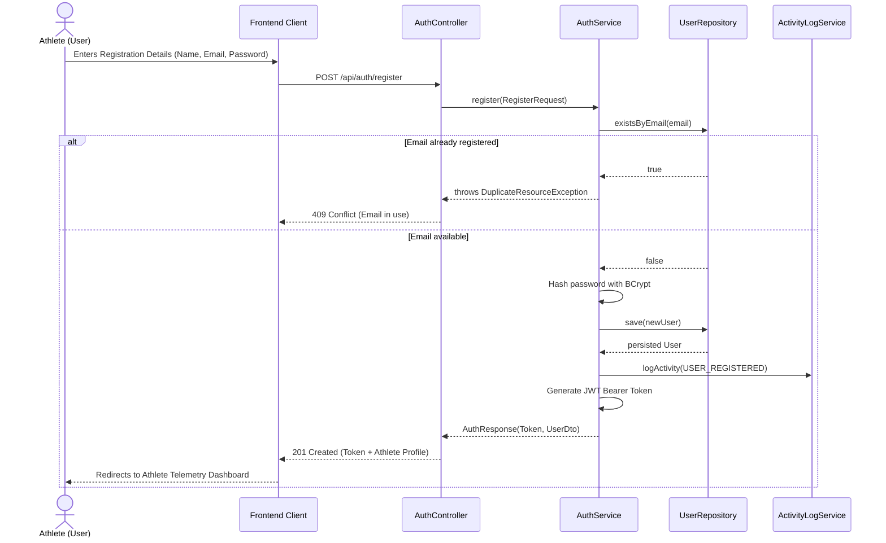

#### Workflow 1.2: Workout Logging & Automated Goal/Challenge Synchronization
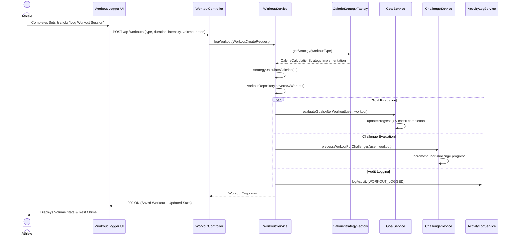

---

### 7.2 Administrator Governance Workflows

#### Workflow 2.1: User Directory Moderation & Role Promotion
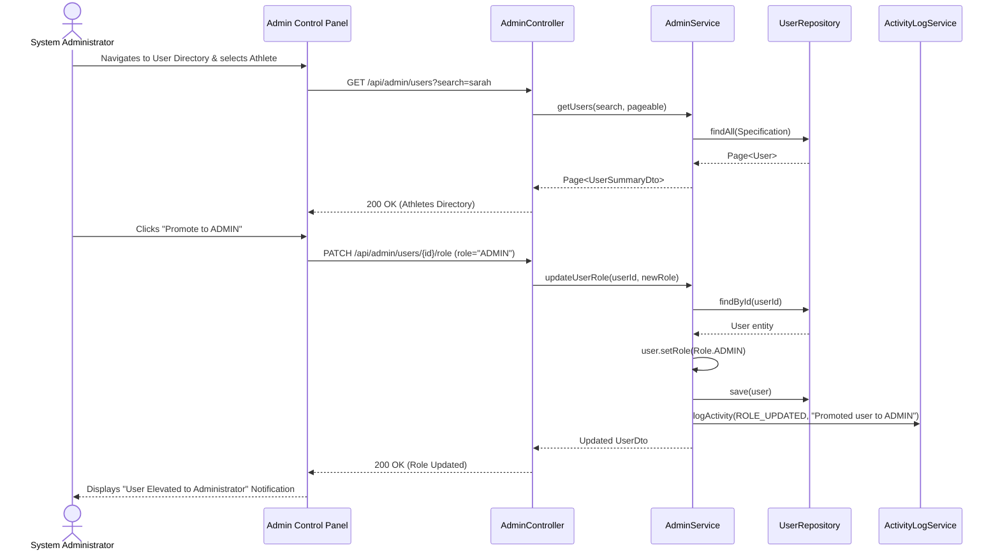

---

## 8. System Architecture Specification

### 8.1 Layered 3-Tier Enterprise Architecture
FitPulse is designed according to the classical, proven enterprise 3-tier model:

1. **Presentation Layer (Tier 1)**:
   - Modern Single Page Application (SPA) built with React 19, TypeScript, Vite, Three.js 3D micro-canvases, and Tailwind CSS.
   - Communicates asynchronously via RESTful HTTP JSON APIs protected with JWT Bearer tokens.
   - Optional Server-Side Rendered (SSR) Thymeleaf templates for internal administrative console backup.

2. **Application / Business Logic Layer (Tier 2)**:
   - Implemented in **Spring Boot 3.3.4 (Java 21)**.
   - Enforces business rules, transactions (`@Transactional`), security filtering, validation (`jakarta.validation`), and algorithmic domain logic.
   - Structured with pure Object-Oriented principles: Polymorphic Strategy engines, Generic DTO envelopes, and interface-based decoupling.

3. **Persistence & Database Layer (Tier 3)**:
   - Object-Relational Mapping (ORM) provided by Spring Data JPA and Hibernate 6.
   - Universal dual-database support: Zero-setup local SQLite / embedded H2 database for rapid development and enterprise PostgreSQL for cloud deployment.
   - Indexed schema design ensuring $O(\log n)$ lookup times for user queries, session telemetry, and audit streams.

---

### 8.2 Controller-Service-Repository Pattern
The backend strictly adheres to the clean separation of concerns:

```
[ HTTP Client Request ]
         │
         ▼
[ @RestController ]  ─── DTO Validation (@Valid) & Request Mapping
         │
         ▼ (Invokes via Interface: e.g., IWorkoutService)
[ @Service Implementation ]  ─── Business Logic, Polymorphic Strategy Engine,
         │                        Security Context, Transaction Boundaries (@Transactional)
         ▼ (Invokes via Interface: e.g., WorkoutRepository)
[ @Repository ]  ─── Spring Data JPA Database Queries & Object Mapping
         │
         ▼
[ Relational Database (SQLite / H2 / PostgreSQL) ]
```

---

### 8.3 Architectural Diagram

```mermaid
graph TD
    subgraph Client_Layer ["Client Presentation Layer"]
        UI_SPA["React 19 / TypeScript SPA (Vite + Tailwind)"]
        UI_3D["Three.js / Anatomical Telemetry"]
        UI_SSR["Thymeleaf Admin Console"]
    end

    subgraph Gateway_Security ["API Security & Gateway"]
        CORS_FILTER["CorsFilter (Origin Whitelist)"]
        JWT_FILTER["JwtAuthenticationFilter (Stateless Bearer)"]
        EX_HANDLER["GlobalExceptionHandler (@RestControllerAdvice)"]
    end

    subgraph Controller_Layer ["REST Controller Layer"]
        AUTH_CTRL["AuthController"]
        WORKOUT_CTRL["WorkoutController"]
        GOAL_CTRL["GoalController"]
        CHALLENGE_CTRL["ChallengeController"]
        CONTENT_CTRL["ContentController"]
        ACTIVITY_CTRL["ActivityLogController"]
        ADMIN_CTRL["AdminController"]
        ANALYTICS_CTRL["AnalyticsController"]
    end

    subgraph Service_Layer ["Decoupled Service Layer (Interfaces & Implementations)"]
        I_AUTH["IAuthService / AuthServiceImpl"]
        I_WORKOUT["IWorkoutService / WorkoutServiceImpl"]
        I_GOAL["IGoalService / GoalServiceImpl"]
        I_CHALLENGE["IChallengeService / ChallengeServiceImpl"]
        I_CONTENT["IContentService / ContentServiceImpl"]
        I_ACTIVITY["IActivityLogService / ActivityLogServiceImpl"]
        I_ADMIN["IAdminService / AdminServiceImpl"]
        I_ANALYTICS["IAnalyticsService / AnalyticsServiceImpl"]
    end

    subgraph Domain_Engine ["Core Domain & Polymorphic Engines"]
        STRATEGY_FAC["CalorieStrategyFactory"]
        STRAT_STRENGTH["StrengthCalorieStrategy"]
        STRAT_CARDIO["CardioCalorieStrategy"]
        STRAT_HIIT["HiitCalorieStrategy"]
        STRAT_CALISTH["CalisthenicsCalorieStrategy"]
        STRAT_YOGA["YogaCalorieStrategy"]
        GOAL_EVAL["GoalEvaluationStrategy"]
    end

    subgraph Repository_Layer ["Spring Data JPA Repository Layer"]
        USER_REPO["UserRepository"]
        WORKOUT_REPO["WorkoutRepository"]
        GOAL_REPO["GoalRepository"]
        CHALLENGE_REPO["FitnessChallengeRepository"]
        USER_CHALL_REPO["UserChallengeRepository"]
        CONTENT_REPO["FitnessContentRepository"]
        ACTIVITY_REPO["ActivityLogRepository"]
        SETTING_REPO["SystemSettingRepository"]
    end

    subgraph Storage_Layer ["Persistence Layer"]
        DB[(Relational DB: SQLite / H2 / PostgreSQL)]
    end

    %% Client to Security
    UI_SPA --> CORS_FILTER
    UI_3D --> CORS_FILTER
    UI_SSR --> CORS_FILTER
    CORS_FILTER --> JWT_FILTER
    JWT_FILTER --> AUTH_CTRL & WORKOUT_CTRL & GOAL_CTRL & CHALLENGE_CTRL & CONTENT_CTRL & ACTIVITY_CTRL & ADMIN_CTRL & ANALYTICS_CTRL

    %% Controllers to Services
    AUTH_CTRL --> I_AUTH
    WORKOUT_CTRL --> I_WORKOUT
    GOAL_CTRL --> I_GOAL
    CHALLENGE_CTRL --> I_CHALLENGE
    CONTENT_CTRL --> I_CONTENT
    ACTIVITY_CTRL --> I_ACTIVITY
    ADMIN_CTRL --> I_ADMIN
    ANALYTICS_CTRL --> I_ANALYTICS

    %% Services to Strategies
    I_WORKOUT --> STRATEGY_FAC
    STRATEGY_FAC --> STRAT_STRENGTH & STRAT_CARDIO & STRAT_HIIT & STRAT_CALISTH & STRAT_YOGA
    I_GOAL --> GOAL_EVAL

    %% Services to Repositories
    I_AUTH --> USER_REPO & ACTIVITY_REPO
    I_WORKOUT --> WORKOUT_REPO & USER_REPO & ACTIVITY_REPO
    I_GOAL --> GOAL_REPO & ACTIVITY_REPO
    I_CHALLENGE --> CHALLENGE_REPO & USER_CHALL_REPO & ACTIVITY_REPO
    I_CONTENT --> CONTENT_REPO & ACTIVITY_REPO
    I_ADMIN --> USER_REPO & SETTING_REPO & ACTIVITY_REPO
    I_ANALYTICS --> WORKOUT_REPO & GOAL_REPO & USER_CHALL_REPO

    %% Repositories to Storage
    USER_REPO & WORKOUT_REPO & GOAL_REPO & CHALLENGE_REPO & USER_CHALL_REPO & CONTENT_REPO & ACTIVITY_REPO & SETTING_REPO --> DB
```

---

## 9. Data-Flow Documentation (DFD)

### 9.1 DFD Level 0 (Context Diagram)
The Context Diagram establishes the boundary of the FitPulse platform with external actors:

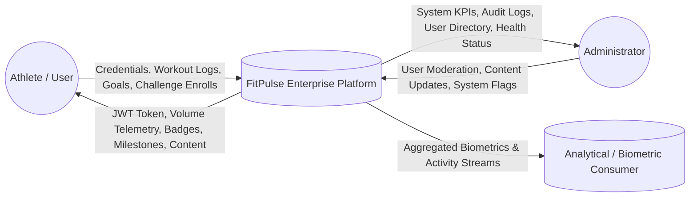

---

### 9.2 DFD Level 1 (Subsystem Decomposed Data Flow)
DFD Level 1 decomposes the system into 6 core operational subsystems and persistent data stores:

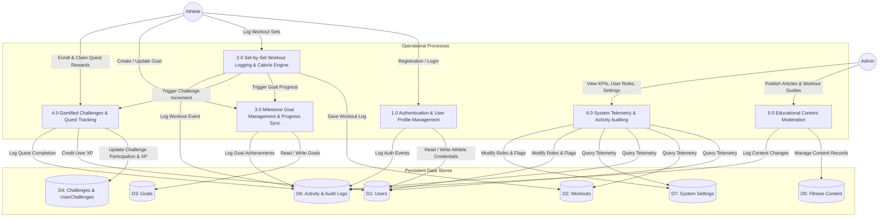

---

## 10. Database Entity Relationship Specification (ERD)

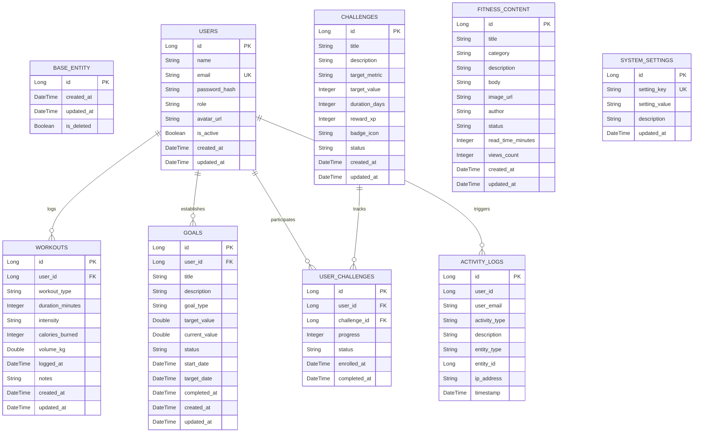

---

## 11. Core Java OOP Architectural Alignment

To satisfy the highest standards of Object-Oriented software engineering in the Java ecosystem, the platform's Java subsystem enforces the following paradigms:

1. **Encapsulation**:
   - All domain entity attributes are strictly `private`.
   - Mutators enforce validation (e.g., negative duration prevention, percentage clamp between 0.0 and 100.0, valid enum state transitions).
   - Defensive copies for mutable timestamps and collections.
2. **Abstraction**:
   - Abstract `BaseEntity` encapsulating primary keys, audit timestamps, and soft deletion flags.
   - Domain interfaces (`Identifiable<ID>`, `Auditable`, `Trackable`, `CalorieCalculable`).
   - Pure service interfaces (`IWorkoutService`, `IGoalService`, `IChallengeService`, `IUserService`, etc.) abstracting business operations from web controllers.
3. **Inheritance**:
   - `BaseEntity` serves as the superclass for `User`, `Workout`, `Goal`, `FitnessChallenge`, `FitnessContent`, `ActivityLog`, and `SystemSetting`.
   - `AbstractCalorieStrategy` provides reusable scientific MET equations inherited by specialized exercise modality strategies.
   - Exception hierarchy rooted at `FitPulseException`, inherited by specific domain exceptions.
4. **Polymorphism**:
   - The **Strategy Pattern** is implemented for Calorie Calculations (`CalorieCalculationStrategy`) dynamically selected at runtime based on `WorkoutType` via `CalorieStrategyFactory`.
   - Dynamic Goal progress evaluation (`GoalProgressStrategy`).
5. **Generics**:
   - Generic response envelopes (`ApiResponse<T>`) and paginated payloads (`PagedResponse<T>`).
   - Generic base repositories (`BaseRepository<T, ID>`) and identifiable contracts (`Identifiable<ID>`).
6. **Collections & Streams**:
   - Idiomatic use of `List<T>`, `Set<T>`, `Map<K, V>`, `Optional<T>`, and `EnumMap`.
   - Java Stream pipelines for aggregation, volume computation, and multi-dimensional grouping (`groupingBy`, `summingInt`).
7. **Rich Domain Enums**:
   - Enums equipped with encapsulated state, constructor arguments, and domain methods (`Role`, `WorkoutType`, `Intensity`, `GoalType`, `GoalStatus`, `ChallengeStatus`, `ActivityType`).
8. **Robust Centralized Exception Handling**:
   - Domain-specific checked/unchecked exception hierarchy mapped cleanly to HTTP status codes via `@RestControllerAdvice`.

---

## 12. JDBC / Database Architecture & ACID Transactions

The FitPulse Java backend incorporates real native JDBC integration alongside Spring Data JPA. This architecture executes direct, high-performance SQL operations with explicit transaction boundary control, zero SQL injection vulnerabilities, and deterministic resource lifecycle management without disturbing or breaking existing database schema tables.

### 12.1 Native JDBC Component Decomposition

| Component | Responsibility | Implementation Details |
| :--- | :--- | :--- |
| `JdbcConnectionManager` | Connection acquisition & transactional template | Wraps Spring `DataSource`, provides direct `java.sql.Connection` instances, and features `<T> executeInTransaction(callback)` executing atomic blocks with automatic commit and rollback. |
| `UserJdbcDao` | Native User entity CRUD | Executes raw SQL via `PreparedStatement` with `Statement.RETURN_GENERATED_KEYS`; maps `ResultSet` to `User` entities; manages XP increments. |
| `WorkoutJdbcDao` | Native Workout CRUD & Multi-Table Transaction | Implements full CRUD; manages atomic multi-table transaction `createWorkoutWithXpTransaction` (inserts workout record + credits user total XP) with explicit `commit()` and `rollback()`. |
| `ChallengeJdbcDao` | Native Challenge CRUD & Atomic Enrollment | Implements full CRUD; executes atomic transaction `enrollUserInChallengeWithTransaction` checking for duplicate enrollment, creating `user_challenges` record, and writing audit entry. |

### 12.2 Universal PreparedStatement Security Guarantee
To guarantee complete immunity against SQL injection vulnerabilities:
- Every query utilizes parameterized statements with `?` placeholders.
- Zero dynamic SQL string concatenation is permitted.
- Strongly typed setters (`setString`, `setLong`, `setInt`, `setTimestamp`, `setBoolean`) bind all inputs safely.

### 12.3 Explicit ACID Transaction Management

FitPulse implements native transaction management adhering to strict ACID guarantees:

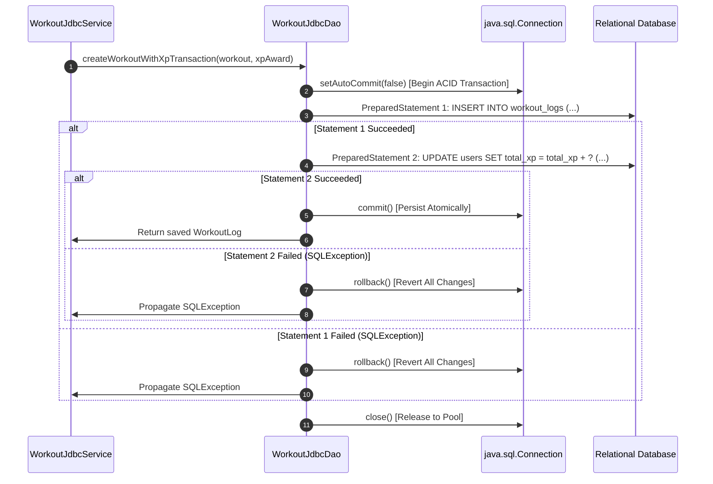

---

## 13. Java Servlets & Web Integration

FitPulse provides native Java `HttpServlet` integration alongside the Spring MVC REST controllers. The Servlets are registered in the embedded Tomcat container using Spring Boot's `ServletRegistrationBean`, providing high-throughput endpoints that talk directly to the JDBC service layer.

### 13.1 End-to-End Architectural Flow
The complete request-response flow strictly maintains:
$$\text{HTTP Request} \longrightarrow \text{HttpServlet} \longrightarrow \text{JDBC Service} \longrightarrow \text{JDBC DAO / Repository} \longrightarrow \text{Database} \longrightarrow \text{HTTP Response}$$

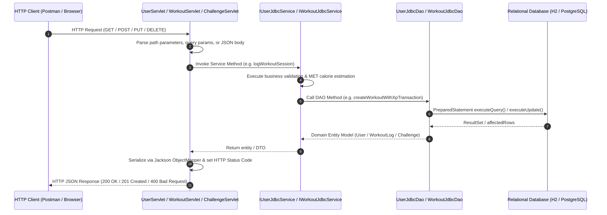

### 13.2 Servlet Endpoint Specification

| Servlet Class | Method | URL Pattern | Responsibility | Status Codes |
| :--- | :--- | :--- | :--- | :--- |
| `UserServlet` | `GET` | `/servlet/users` | List paginated users | `200 OK`, `500 Server Error` |
| `UserServlet` | `GET` | `/servlet/users/{id}` | Retrieve athlete profile by ID | `200 OK`, `404 Not Found` |
| `UserServlet` | `POST` | `/servlet/users` | Register athlete via JDBC | `201 Created`, `400 Bad Request` |
| `UserServlet` | `PUT` | `/servlet/users/{id}` | Update athlete details | `200 OK`, `404 Not Found` |
| `UserServlet` | `DELETE`| `/servlet/users/{id}` | Soft delete athlete account | `200 OK`, `404 Not Found` |
| `WorkoutServlet` | `GET` | `/servlet/workouts` | List paginated workout logs | `200 OK`, `500 Server Error` |
| `WorkoutServlet` | `GET` | `/servlet/workouts/{id}` | Get workout session by ID | `200 OK`, `404 Not Found` |
| `WorkoutServlet` | `GET` | `/servlet/workouts?userId={id}`| Filter workouts by athlete | `200 OK`, `500 Server Error` |
| `WorkoutServlet` | `POST` | `/servlet/workouts` | Log workout + credit XP (ACID Tx) | `201 Created`, `400 Bad Request` |
| `WorkoutServlet` | `PUT` | `/servlet/workouts/{id}` | Update workout telemetry | `200 OK`, `404 Not Found` |
| `WorkoutServlet` | `DELETE`| `/servlet/workouts/{id}` | Delete workout record | `200 OK`, `404 Not Found` |
| `ChallengeServlet`| `GET` | `/servlet/challenges` | List all community challenges | `200 OK`, `500 Server Error` |
| `ChallengeServlet`| `GET` | `/servlet/challenges/active` | List open active challenges | `200 OK`, `500 Server Error` |
| `ChallengeServlet`| `GET` | `/servlet/challenges/{id}` | Get challenge by ID | `200 OK`, `404 Not Found` |
| `ChallengeServlet`| `POST` | `/servlet/challenges` | Create new challenge | `201 Created`, `400 Bad Request` |
| `ChallengeServlet`| `POST` | `/servlet/challenges/{id}/enroll`| Enroll athlete in challenge (ACID Tx)| `201 Created`, `400 Bad Request` |
| `ChallengeServlet`| `PUT` | `/servlet/challenges/{id}` | Update challenge criteria | `200 OK`, `404 Not Found` |
| `ChallengeServlet`| `DELETE`| `/servlet/challenges/{id}` | Soft delete challenge | `200 OK`, `404 Not Found` |

---

## 14. Progress Tracking & Database Analytics Engine

To eliminate deceptive hardcoded mock values, FitPulse implements a pure database aggregation analytics engine across both Java Spring Boot and Node.js/Express backends.

### 14.1 Metrics & Mathematical Formulas
Every metric displayed on the Athlete Biomechanics Dashboard and the Analytics Page is calculated dynamically from persisted records:

1. **Weekly Activity (Rolling 7 Days)**:
   $$\text{Weekly Duration (hours)} = \frac{1}{60} \sum_{i \in \text{Workouts}_{t \ge \text{now} - 7d}} \text{duration\_minutes}_i$$
   $$\text{Weekly Caloric Output (kcal)} = \sum_{i \in \text{Workouts}_{t \ge \text{now} - 7d}} \text{calories\_burned}_i$$
   $$\text{Weekly Session Count} = |\text{Workouts}_{t \ge \text{now} - 7d}|$$

2. **Monthly Activity (Rolling 30 Days)**:
   $$\text{Monthly Duration (hours)} = \frac{1}{60} \sum_{i \in \text{Workouts}_{t \ge \text{now} - 30d}} \text{duration\_minutes}_i$$
   $$\text{Monthly Caloric Output (kcal)} = \sum_{i \in \text{Workouts}_{t \ge \text{now} - 30d}} \text{calories\_burned}_i$$
   $$\text{Monthly Session Count} = |\text{Workouts}_{t \ge \text{now} - 30d}|$$

3. **Goal Progress Aggregation**:
   $$\text{Average Completion \%} = \frac{1}{N_{\text{goals}}} \sum_{g=1}^{N_{\text{goals}}} \min\left(100, \left\lfloor \frac{\text{current\_value}_g}{\text{target\_value}_g} \times 100 \right\rfloor\right)$$

4. **Challenge Progress Aggregation**:
   $$\text{Challenge Completion Rate \%} = \frac{|\text{UserChallenges}_{\text{COMPLETED}}|}{|\text{UserChallenges}_{\text{TOTAL}}|} \times 100$$

5. **Rolling 7-Day Baseline Distribution**:
   - For every day in the last 7 calendar days $[d-6, \dots, d-0]$, the system seeds a zero baseline and aggregates logged duration and caloric output. Days without recorded sessions render an honest 0 kcal baseline, eliminating misleading static defaults.

---

## 15. Fitness Goals Architecture & Lifecycle

Personal fitness goals empower athletes to define verifiable milestones across Caloric Burn (`CALORIE_BURN`), Training Duration (`DURATION_MINUTES`), Session Frequency (`WORKOUT_COUNT`), or Distance (`DISTANCE`).

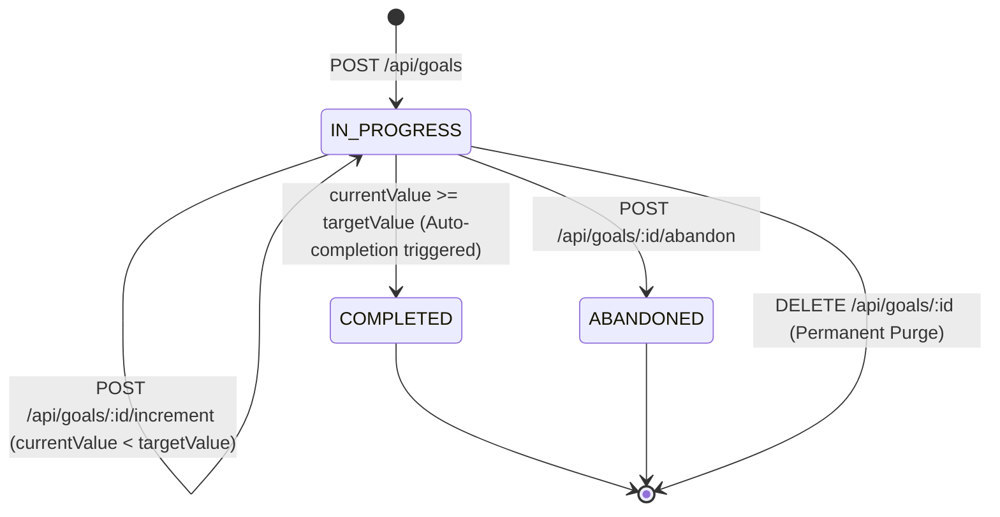

### 15.1 Goals CRUD API Contract
| Operation | Method | Route | Description |
| :--- | :--- | :--- | :--- |
| **Create** | `POST` | `/api/goals` | Creates a milestone with title, description, target value, initial value, deadline (`targetDate`), and calculated percentage. |
| **Read** | `GET` | `/api/goals` | Lists all personal goals for the authenticated athlete with status filtering (`?status=IN_PROGRESS`). |
| **Read Single** | `GET` | `/api/goals/:id` | Returns specific goal details; strictly validates athlete ownership. |
| **Update** | `PUT` | `/api/goals/:id` | Modifies target, current progress, deadline, or status; auto-transitions to `COMPLETED` when target met. |
| **Increment** | `POST` | `/api/goals/:id/increment`| Quick-increment endpoint allowing atomic addition to `current_value`. |
| **Abandon** | `POST` | `/api/goals/:id/abandon` | Transitions an active goal to `ABANDONED` without deletion. |
| **Delete** | `DELETE`| `/api/goals/:id` | Permanently deletes goal record from database with ownership enforcement. |

---

## 16. Fitness Challenges Governance & Gamification

The FitPulse Challenge Arena delivers collaborative gamification with administrative oversight, strict duplicate prevention, and persistent historical tracking.

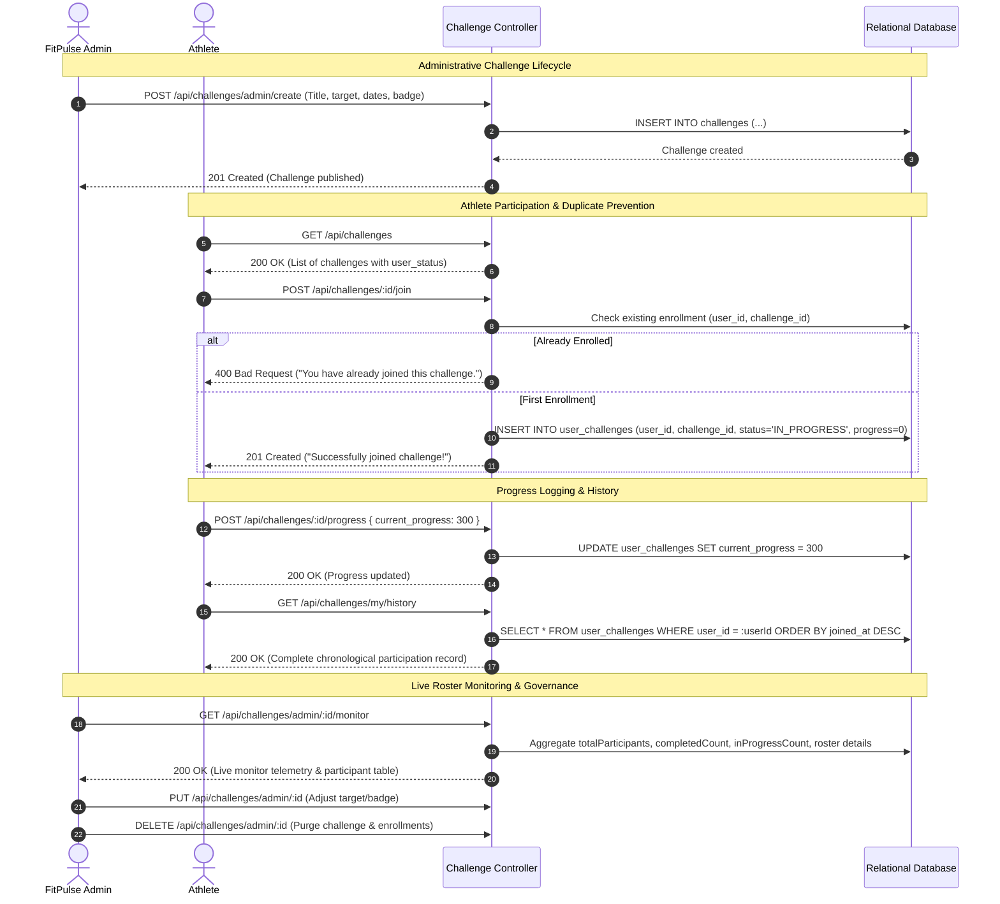

---

## 17. Admin User Management Architecture (Requirement 10)

FitPulse implements administrative control over user accounts, incorporating role-based privilege management, live search filtering, account deactivation/suspension, and self-protection constraints.

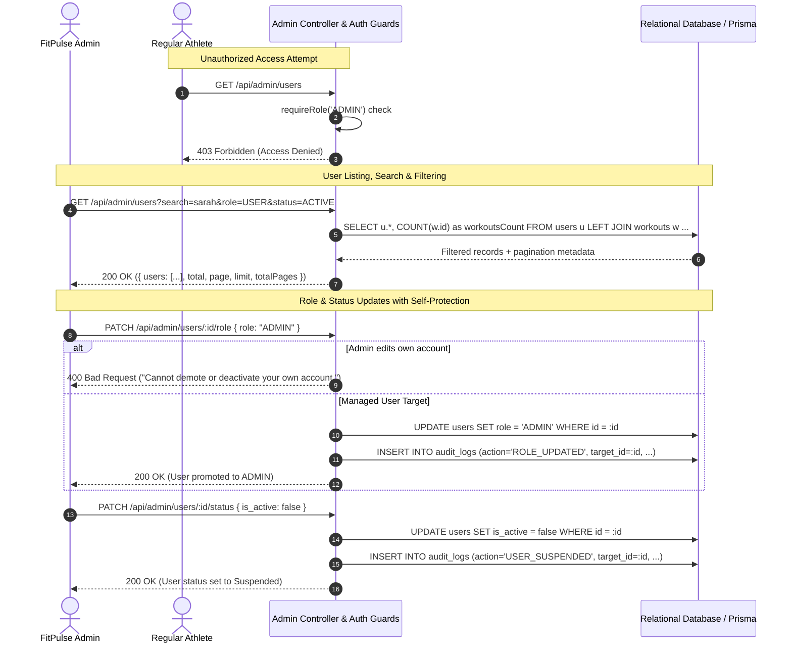

### 17.1 Admin User Management API Contract
| Method | Route | Description | Authorization |
| :--- | :--- | :--- | :--- |
| `GET` | `/api/admin/users` | List users with query search (`name`, `email`), `role` (`ALL`, `USER`, `ADMIN`), and `status` (`ACTIVE`, `SUSPENDED`). | `ADMIN` only (403 for `USER`) |
| `POST` | `/api/admin/users` | Admin provisions an athlete or staff account directly. | `ADMIN` only |
| `PATCH` | `/api/admin/users/:id` | Edit user name, email, role, or active status. Prevents self-demotion. | `ADMIN` only |
| `PATCH` | `/api/admin/users/:id/role` | Promote/demote user permissions (`USER` ↔ `ADMIN`). | `ADMIN` only |
| `PATCH` | `/api/admin/users/:id/status`| Deactivate or reactivate athlete account (`is_active: boolean`). | `ADMIN` only |
| `DELETE`| `/api/admin/users/:id` | Soft-deactivates or purges user account with audit logging. Self-deletion blocked. | `ADMIN` only |

---

## 18. Fitness Content Moderation Pipeline (Requirement 11)

FitPulse delivers a content curation and publishing workflow that ensures community nutrition guides, training protocols, and workout routines meet safety and scientific quality standards.

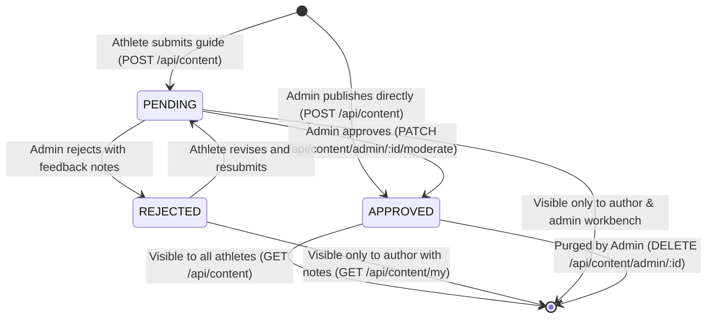

### 18.1 Content Access & Isolation Matrix
- **Public Feed (`GET /api/content`)**: Strictly filtered by `WHERE status = 'APPROVED'`. Regular users and public athletes can never access unreviewed drafts or rejected material.
- **Athlete Submissions (`GET /api/content/my`)**: Authenticated athletes can view their entire submission history (`PENDING`, `APPROVED`, `REJECTED`) along with any reviewer feedback provided by staff.
- **Admin Moderation Workbench (`GET /api/content/admin/all`)**: Administrators view all submissions across any status, filter by status tab (`ALL`, `PENDING`, `APPROVED`, `REJECTED`), approve with 1 click, or reject with a feedback dialog.

---

## 19. System Settings Database Engine (Requirement 12)

FitPulse eliminates hardcoded configuration flags by persisting all platform operational toggles into the relational database (`SystemSetting` entity), allowing live runtime adjustments without system restarts.

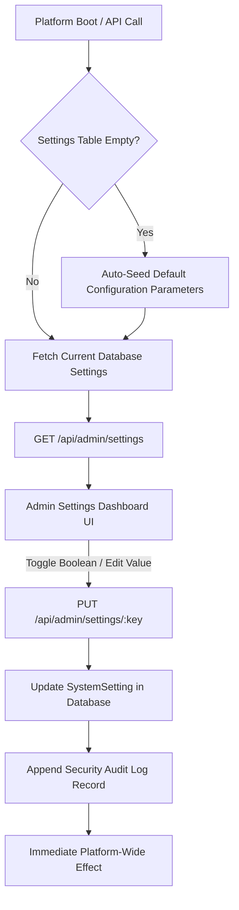

### 19.1 Persisted System Settings Schema & Default Keys
| Configuration Key | Default Value | Type | Functional Impact |
| :--- | :--- | :--- | :--- |
| `maintenance_mode` | `false` | `boolean` | When true, restricts athlete write access for scheduled infrastructure upgrades. |
| `user_registration_enabled`| `true` | `boolean` | Controls public signups; toggling off creates an invitation-only state. |
| `require_email_verify` | `false` | `boolean` | Enforces verification step prior to granting full workout logging access. |
| `dynamic_met_scaling` | `true` | `boolean` | Enables real-time MET calorie burn calculations based on bodyweight and intensity. |
| `max_workout_duration_minutes` | `360` | `number` | Enforces sanitization boundary on excessive workout durations (6-hour safety cap). |

All updates to system parameters are captured in `audit_logs` with the performing Administrator's ID, timestamp, and previous state.

---

## 20. Activity Monitoring & Security Audit Trail (Requirement 13)

FitPulse implements an immutable activity logging pipeline that records all critical user, workout, challenge, and administrative operations.

```mermaid
sequenceDiagram
    autonumber
    actor Actor as Athlete / Admin
    participant Controller as Domain Controller
    participant Service as Domain Service
    participant ActivityService as Activity Service
    participant DB as Audit Logs Table

    Actor->>Controller: HTTP Request (e.g., Log Workout, Join Challenge, Moderate Content)
    Controller->>Service: Execute Domain Business Logic
    Service->>DB: Perform Relational State Mutation
    Service->>ActivityService: ActivityService.log(actorId, actionType, detailsPayload)
    ActivityService->>DB: INSERT INTO audit_logs (user_id, action, details, timestamp)
    Service-->>Controller: Domain Response
    Controller-->>Actor: 200/201 Success Response
```

### 20.1 Core Event Domain Taxonomy
| Domain | Action Name | Context Payload Attributes |
| :--- | :--- | :--- |
| **Authentication** | `USER_LOGIN` | IP address, timestamp, client user agent |
| **Account** | `USER_REGISTER` | Email address, role assigned |
| **Workout** | `LOG_WORKOUT` | Workout ID, type, duration (minutes), calories burned |
| **Workout** | `UPDATE_WORKOUT` | Workout ID, modified parameters |
| **Workout** | `DELETE_WORKOUT` | Workout ID, discipline type |
| **Challenge** | `JOIN_CHALLENGE` | Challenge ID, quest title |
| **Challenge** | `UPDATE_CHALLENGE_PROGRESS` | Challenge ID, new progress value, milestone status |
| **Challenge** | `CHALLENGE_COMPLETED` | Challenge ID, quest title, final score |
| **User Admin** | `ADMIN_CREATE_USER` | Target user ID, email address, role |
| **User Admin** | `ADMIN_UPDATE_USER` | Target user ID, updated field parameters |
| **User Admin** | `ADMIN_UPDATE_ROLE` | Target user ID, previous role, elevated role |
| **User Admin** | `ADMIN_TOGGLE_USER_STATUS` | Target user ID, boolean active state |
| **User Admin** | `ADMIN_DELETE_USER` | Target user ID, email address |
| **Content** | `CREATE_FITNESS_CONTENT` | Content ID, title, initial state (`PENDING` or `APPROVED`) |
| **Content** | `MODERATE_CONTENT` | Content ID, status (`APPROVED`/`REJECTED`), reviewer feedback |
| **Content** | `DELETE_FITNESS_CONTENT` | Content ID, guide title |
| **Settings** | `UPDATE_SYSTEM_SETTING` | Configuration key, updated value |

---

## 21. Real Database-Driven Admin Statistics Engine (Requirement 14)

FitPulse replaces mock statistics with live database queries across all domain entities:

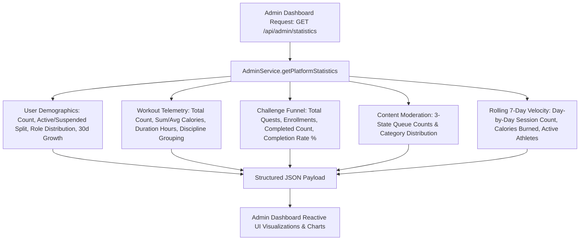

---

## 22. Code Quality, Clean Architecture & Security Standards (Requirement 15)

FitPulse enforces industry-standard software engineering practices across both the Node.js/Express and Java Spring Boot implementations:

### 22.1 Layered Architectural Separation
```
Client (React / Vite)
       │
       ▼
Controllers (HTTP Parsing, Validation & Status Codes)
       │
       ▼
Services (Business Logic, Calorie Calculations, Propagation, Audit Logging)
       │
       ▼
Repositories & Models (Prisma ORM / Spring Data JPA & JDBC)
       │
       ▼
Database (SQLite / PostgreSQL)
```

1. **Controller → Service → Repository Separation**:
   - Controllers handle HTTP request validation and JSON responses.
   - Business logic is isolated in dedicated service classes (`AdminService`, `WorkoutService`, `AuthService`, `ActivityService`).
2. **Proper Naming Conventions**:
   - PascalCase for classes and interfaces (`AdminService`, `PlatformStatistics`).
   - camelCase for methods, variables, and properties (`getPlatformStatistics`, `activeWorkoutsToday`).
   - UPPER_SNAKE_CASE for constants and enum types (`USER_LOGIN`, `CALORIES`, `HIGH`).
3. **Dead Code & Log Elimination**:
   - No dead or unreferenced code.
   - Unnecessary debug `console.log` statements removed in favor of structured audit logs and server request logging.
4. **Environment Secret Decoupling**:
   - Zero hardcoded credentials or private keys in source code.
   - Standardized `backend/.env.example` template provided with configuration instructions.

---

## 23. Team Responsibilities & Contributions (Requirement 17)

For full architectural ownership mapping and detailed engineering handoffs, refer to the dedicated specification:
👉 **[Team Responsibilities & Engineering Contributions Documentation](file:///c:/Users/user/Downloads/GUVI_Java_Project-main/GUVI_Java_Project-main/docs/TEAM_RESPONSIBILITIES_AND_CONTRIBUTIONS.md)**

### Authentic Modular Division of Engineering Domains:
* **Module 1: Core Java, JDBC & Servlet Engineering Subsystem**: Complete OOP hierarchy (`BaseEntity`, `Workout`, `Goal`, `Challenge`), strategy pattern for metabolic calculations, raw JDBC services with transactional rollback, and Jakarta Servlet endpoints.
* **Module 2: REST API & Relational Database Architecture**: High-performance Express REST API, Prisma schema modeling, and decoupled domain services (`AdminService`, `ActivityService`, `WorkoutService`).
* **Module 3: Frontend Engineering & WebGL 3D Visualization**: Reactive SPA in React 19, interactive workout logging console, and hardware-accelerated WebGL visualizations (`AdminGlobe3D`, `MuscleAnatomy3D`, `HolographicBadge3D`, `ActivityOrb`).
* **Module 4: Security, RBAC & Audit Telemetry**: Dual-role authorization (`USER` vs `ADMIN`), defensive self-protection guards, and tamper-resistant audit logging (`ActivityLog`).
* **Module 5: Automated Testing & Quality Assurance**: Comprehensive automated test harness (`test-e2e.ts`) verifying 72+ positive and negative assertions with 0 failures, plus JUnit 5 Mockito Java service suites.
* **Module 6: System Architecture & Technical Specifications**: End-to-end design documentation, ER diagrams, DFD Level 0/1 diagrams, and API manuals.
